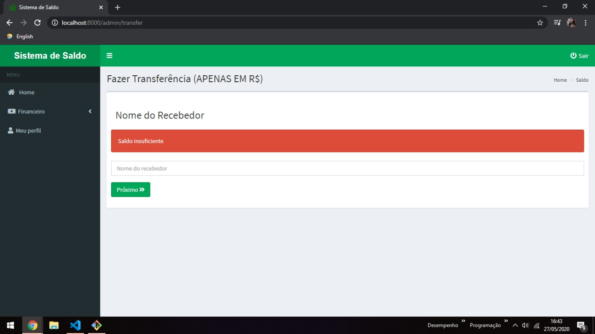

# Portfolio
> Segue abaixo alguns dos meus trabalhos como programador fullstack usando as linguagens JAVA, Javascript, PHP. Em relação ao front-end: HTML e CSS.
* Dia das mães 2017
* Media Tech - Site de noticias (2017)
* PassWord Cripto - (2017)
* Miss Formiga - Doceteria (2018)
* LeFeu - App para restaurante (2018)
* Tindev (Desafio Omnistack) - App de encontro de Devs (2019)

# Dia das mães - 2017
> Meu primeiro projeto: Site desenvolvido em homenagem ao dias das mães com algumas dicas de saúde e com o cálculo de IMC.Desenvolvido em Javascript, HTML e CSS.

# Sistema de Saldo - 2020
> Site desenvolvido em Laravel, com objetivo de adquirir mais conhecimento neste framework. O sistema consiste em uma simulação de transações de dinheiro tais como transferência, saque e depósito. Além disso o sistema é bem intuitivo e apresenta um sistema de login e personalização do usuário.

